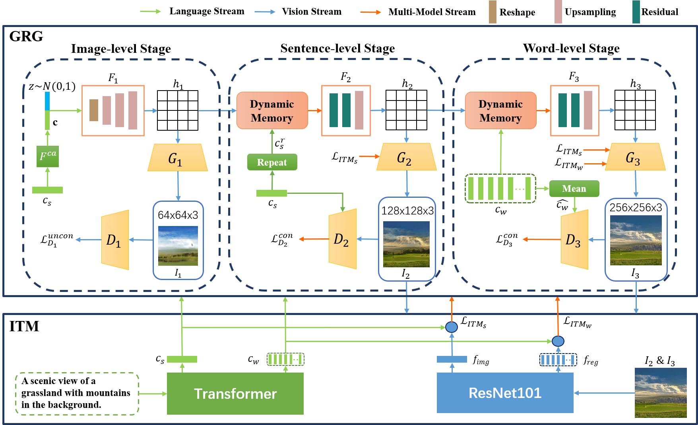

# GR-GAN

Pytorch implementation for reproducing GR-GAN results in the paper [GRADUAL REFINEMENT TEXT-TO-IMAGE GENERATION](https://arxiv.org/abs/2205.11273)

# Usage
Get the code from github:`git clone https://github.com/BoO-18/GR-GAN.git`

Create a new conda env:`conda create -n grgan python=3.7` and `conda activate grgan`

Install `torch==1.7.1`: `conda install pytorch==1.7.1 torchvision==0.8.2 torchaudio==0.7.2 cudatoolkit=11.0`

Folder CLIP is code from [OPENAI](https://github.com/openai/CLIP) with some changes to the output of the image encoder and text encoder. You should run:`pip install CLIP`to install it. 

**Data**

1. Download our preprocessed metadata for [coco](https://drive.google.com/open?id=1rSnbIGNDGZeHlsUlLdahj0RJ9oo6lgH9) and save them to `data/`
2. Download [coco](http://cocodataset.org/#download) dataset and extract the images to `data/coco/`

**Training**
- Pre-train ITM models: `python pretrain_ITM.py --cfg cfg/ITM/coco.yml --gpu 0`
 
- Train GR-GAN models: `python main.py --cfg cfg/coco_GRAGN.yml --gpu 1`

- `*.yml` files are example configuration files for training/evaluation our models.

**Pretrained Model**
- [ITM for coco](https://drive.google.com/drive/folders/1j1RIy3BRI-pfAP4qaSn4ugnFXLymEg_Q?usp=sharing) or [Use Alternate address](https://pan.baidu.com/s/12MiPrA1NMteUAPzXq-XZFg?pwd=jnzz)提取码(Extraction code)：`jnzz`. Download and save it to `models/`
- [GR-GAN for coco](https://drive.google.com/drive/folders/1VYZREC7gQbNIabr0L2rxoh5Jv2Vdy2Ah?usp=sharing) or [Use Alternate address](https://pan.baidu.com/s/1pqtzFcgxcX6rl5tpCAkXjg?pwd=lbre)提取码(Extraction code)：`lbre`. Download and save it to `models/`

**Demo**
- File `code/demo.ipynb` is a detailed usage example for GR-GAN.

**Validation**
- Generate images for GR-GAN models on MS-COCO: `python main.py --cfg cfg/eval_coco.yml --gpu 2`
- We compute inception score for models trained on coco: `python CMD_score.py --path1 image_feature.npz --path2 sent_feature.npz --path3 (your image path) --gpu 3`
